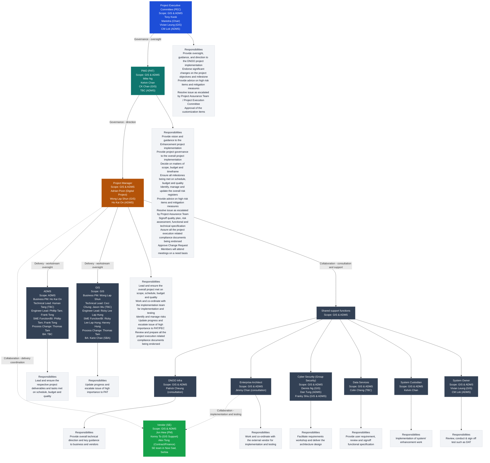

# Feature Specification: DNOO Enhancement

**Feature Branch**: `001-dnoo-enhancement`  
**Created**: 2026-03-03  
**Status**: Draft  
**Input**: _Paste raw notes / requirements here; I’ll refine wording and structure._

## Overview

### Problem Statement

#### Background

The 2026 Enhancement Project for both the Advanced Distribution Management System (ADMS) and the Geographical Information System (GIS) is proposed as a strategic follow-up to the successful rollout of the new GIS (July 2025) and ADMS (October 2025).

While the original GIS program achieved its core objectives—consolidating multiple legacy systems, streamlining distribution network design-to-commissioning processes, and establishing a single source of truth for network models to support ADMS integration—it was delivered under tight timelines and resource constraints. To meet deadlines, temporary fixes and workaround solutions were adopted. Post-rollout, these have contributed to operational inefficiencies and user dissatisfaction.

#### Rationale / Why Now

Continuous feedback from business users has highlighted:

- Functionality gaps compared to the legacy GIS
- New requirements triggered by evolving business processes and regulatory changes

These are newly triggered needs (not residual tasks from the original GIS rollout). To maintain momentum and keep GIS robust and future-proof, a dedicated enhancement project is required.

#### Strategic Intent

This enhancement initiative is positioned to:

- Address new business and regulatory requirements
- Improve operational efficiency
- Support strategic developments such as the introduction of the 22kV network
- Eliminate high-effort manual workarounds that increase risk to data integrity and system performance

### Overall Goals

- Close priority functionality gaps versus the legacy GIS.
- Implement newly triggered business process and regulatory requirements.
- Reduce or eliminate manual workarounds and temporary fixes that create operational inefficiency.
- Protect data integrity and system performance by removing workaround-driven processes.
- Ensure GIS remains robust and future-proof while continuing to support ADMS integration.
- Enable strategic network developments (including introduction of the 22kV network).

### Out of Scope (Constraints)

- Fixing legacy data issues not addressed in the original project.
- Enhancements directly triggered by the Enlight (ERP) project.
- Tasks considered as product enhancement or unfinished bugs from the original GIS project.
- Broader system integration beyond GIS and ADMS.

### Deliverables

The enhancement program delivers improvements across two primary workstreams:

#### A. ADMS Enhancements

1. OMS Workflow Integration
Full integration of ATA triggering logic post-Enlight to streamline outage management.

2. Voltage Level Expansion
Support for 22kV networks (trial in Q1 2026, full rollout by 2029).

3. Automation of Switching Plan State Transitions
API-driven updates with OPS to reduce manual conflict checks and improve operational efficiency.

4. Multi-Stage Outage Support
Enhanced handling of complex outage scenarios across ADMS and GIS.

5. Compliance and Efficiency Improvements
Integration with ORMS for regulatory compliance and optimized workflows.

6. Safety Document and UAT Enhancements
Updated templates and JIRA-based issue tracking for user acceptance testing.

7. Advanced Query Engine
Support for Switching Management fields and clash-check logic.

#### B. GIS Enhancements

The 2026 Enhancement Project for GIS will deliver a comprehensive set of enhancements across five key areas.

1. Excavation Permit Application Enhancements
- Integration of private lot data, Government Land Licenses (GLL), Government Land Allocations (GLA), Short Term Tenancies (STT), and project limits into GIS.
- Development of a workflow to export relevant landbase information with each permit application.
- Implementation of a mechanism for more frequent or real-time updates of landbase data from the Lands Department.

2. Circuit Reporting Enhancements
- Implementation of logic to automatically adjust segment length proportionally when electric lines are split or vertices are edited.
- Default assignment of segment length equal to sharp length upon circuit creation, with user override capability.
- Development of circuit analysis report to facilitate a structured and risk‑based approach to 11 kV cable and joint replacement planning.

3. Common Cable Infrastructure (CCI) Inventory Automation
- Establishment of containment relationships between CCI assets (e.g., cable bridges, tunnels) and the circuits they contain.
- Automation of inventory updates and report generation based on GIS data changes.

4. 22kV Network Configuration
- Configuration of GIS to support 22kV network visualization, including symbology and equipment catalogues.
- Update of network model parameters to accommodate 22kV assets and operations.

5. Automation of High-Impact Manual Workarounds
- Development of functionality to automatically generate Name and Alias fields used by ADMS.
- Identification and implementation of other high-effort manual processes that can be automated within GIS.
- Implementing a centralized session monitoring mechanism for ArcGIS to allow users tracking the status of their sessions after submission and approval.

##### Detailed Objectives

The GIS enhancement scope is designed with a clear set of objectives aligned to both business needs and regulatory mandates:

a) **Address Newly Triggered Regulatory Requirements**

- Recent changes in regulatory expectations—particularly around excavation permit applications and Common Cable Infrastructure (CCI) monitoring—require enhancements to GIS capabilities.
- The project will ensure GIS can support real-time landbase updates, integrate private lot data, and automate inventory tracking of CCI assets to meet compliance standards.

b) **Improve Operational Efficiency and Data Integrity**

- Manual workarounds adopted during the original project continue to impact productivity and data quality.
- Example: the lack of automated generation of Name and Alias fields used by ADMS requires significant manual effort and increases the risk of human error.
- The enhancement project will automate these processes, reducing operational overhead and improving system reliability.

c) **Support Strategic Network Development Initiatives**

- The company is preparing to introduce a 22kV network.
- While the original GIS project considered this in its data model design, additional configuration is required to fully support the new network (e.g., symbology, new equipment catalogues, and configuration parameter updates).

d) **Replace High-Effort Workarounds with Sustainable Solutions**

- Some requirements were deferred during the original project because they could not be realized using out-of-the-box GIS solutions.
- These were categorized as vendor “enhancements” and require custom development.
- The enhancement project will selectively implement those with the highest operational impact, replacing manual processes with automated, sustainable solutions.

e) **Ensure Continued Alignment with Business and Regulatory Evolution**

- As business processes evolve and regulatory requirements change, GIS must remain adaptable and responsive.
- The enhancement project positions GIS as a dynamic platform capable of continual improvement, rather than a static system frozen at its initial implementation state.

##### High-Level Timeline

| Phase / Workstream | M-2 | M-1 | M | M2 | M3 | M4 | M5 | M6 | M7 | M8 | M9 | M10 | M11 | M12 | M+1 |
| --- | --- | --- | --- | --- | --- | --- | --- | --- | --- | --- | --- | --- | --- | --- | --- |
| Phase 1: Planning & Design | ■ | ■ | ■ |  |  |  |  |  |  |  |  |  |  |  |  |
| Phase 2: Development & Configuration |  |  |  | ■ | ■ | ■ | ■ | ■ | ■ |  |  |  |  |  |  |
| Phase 3: Testing & Validation (SIT/UAT/Pen Test) |  |  |  |  |  |  | ■ | ■ | ■ | ■ | ■ | ■ |  |  |  |
| Enlight freeze period (TBC) |  |  |  |  | ■ | ■ | ■ | ■ | ■ |  |  |  |  |  |  |
| Phase 4: Pilot Deployment (22kV trial) |  |  |  |  |  |  |  |  |  |  |  |  | ■ | ■ | ■ |
| Full Deployment & Optimization |  |  |  |  |  |  |  |  |  |  |  |  | ■ | ■ | ■ |
| BAU / Scale-up |  |  |  |  |  |  |  |  |  |  |  |  |  |  | ■ |

### Assumptions 

#### As-Is Assumption

Current operations in the DNOO environment rely on the assumption that manual workarounds are sufficient to address system limitations and unresolved issues. These workarounds are embedded in day-to-day processes and are relied upon to maintain business continuity.

#### Key Risks and Illustrative Examples

- **Operational inefficiency**: Staff are required to process supply point and meter associations individually due to the absence of a bulk processing capability. This creates significant recurring manual effort and increases the risk of error.
- **Risk to business continuity and compliance**: Switching Order Management remains a manual process, exposing the organization to potential supply interruptions and operational incidents because automation is not available to reliably support these critical functions.
- **Data integrity and decision-making**: Manual updates to cable segments and duct bank data patching are necessary to maintain data quality, but these interventions can lead to inconsistencies and incomplete records, impacting asset management and regulatory reporting.
- **Employee experience and organizational morale**: Users must perform repetitive, complex tasks such as updating asset attributes and migrating hyperlinks for supply points. This increases frustration and support demand and can negatively affect morale.
- **Delayed digital transformation**: Limited automation means integration and improved service delivery are not fully realized. Examples include the absence of a readable LV schematic and continued manual data patching for regulatory reports.

#### As-Is Conclusion

Continuing to rely on manual workarounds assumes that temporary solutions are sustainable for ongoing operations. In practice, this perpetuates inefficiency, increases risk exposure, and constrains the organization’s ability to achieve strategic objectives. Transitioning to robust, automated solutions through the DNOO enhancement is necessary to address these risks and support future growth.

### Project Governance & Organization

This section summarizes project governance, reporting lines, and role responsibilities based on the Roles & Responsibilities (R&R) table.

#### Organization Chart

#### Responsibilities by Role

##### PMO (PAT)

**Scope**: GIS & ADMS

**Name list**: Mike Ng; Kelvin Chan; CK Chan (GIS); TBC (ADMS)

- Provide vision and guidance to the enhancement project implementation.
- Provide project governance to the overall project implementation.
- Decide on matters of scope, budget, and timeframe.
- Ensure milestones are met on schedule, budget, and quality.
- Identify, manage, and update the overall risk registers.
- Provide advice on high-risk items and mitigation measures.
- Align and resolve issues as escalated by each project champion.
- Resolve issue as escalated by Project Assurance Team.
- Signoff quality plan, risk assessment, functional and technical specification.
- Assure all the project execution related compliance documents being endorsed.
- Approve change requests.
- Members attend meetings on a need basis (e.g., critical decisions, procurement stage, design & implementation stage).

##### Project Executive Committee (PEC)

**Scope**: GIS & ADMS

**Name list**: Tony Kwok; Manisha (Chair); Vivian Leung (GIS); CM Lok (ADMS)

- Provide oversight, guidance, and direction to the DNOO project implementation.
- Endorse significant changes to project objectives and milestones.
- Provide advice on high-risk items and mitigation measures.
- Resolve issue as escalated by Project Assurance Team / Project Execution Committee.
- Approve customization items.

##### Project Manager

**Scope**: GIS & ADMS

**Name list**: Adrian Poon (Digital Project); Wong Lap Shun (GIS); Ho Kai On (ADMS)

- Lead and ensure the overall project met on scope, schedule, budget and quality.
- Work and co-ordinate with the implementation team for implementation and testing.
- Identify and manage risks.
- Update progress and escalate issue of high importance to PAT/PEC.
- Review and prepare all the project execution related compliance documents being endorsed.

##### Implementation Team (Overall)

**Scope**: GIS & ADMS

**Name list**: ADMS Team; GIS Team; DNOO Infra; Enterprise Architect; Cyber Security (Group Security); Data Services; System Custodian; System Owner

- Identify & validate change requests.
- Collect and consolidate the feedback from the users.
- Review and initiate the process changes.
- Identify the risks.
- Provide on-going support.

##### ADMS Team

**Scope**: ADMS

**Name list**: Business PM: Ho Kai On; Technical Lead: Human Tang (TBC); Engineer Lead: Phillip Tam; Frank Tong; SME (Function and Business Improvement): Phillip Tam; Frank Tong; Process Change (Change Management): Thomas Tam; BA: TBC

- Lead and ensure the respective project deliverables and tasks met on schedule, budget and quality.

##### GIS Team

**Scope**: GIS

**Name list**: Business PM: Wong Lap Shun; Technical Lead: Ceci Chung; Jason Wu (TBC); Engineer Lead: Ricky Lee Lap Hung; SME (Function and Business Improvement): Ricky Lee Lap Hung; Harvey Hung; Process Change (Change Management): Thomas Tam; BA: Karie Chan (SBA)

- Update progress and escalate issue of high importance to PAT.

##### DNOO Infra

**Scope**: GIS & ADMS

**Name list**: Patrick Cheung (consultation)

- Provide overall technical direction and key guidance to business and vendors.

##### Enterprise Architect

**Scope**: GIS & ADMS

**Name list**: Jimmy Chan (consultation)

- Work and co-ordinate with the external vendor for implementation and testing.

##### Group Security

**Scope**: GIS & ADMS

**Name list**: Dennis Ng (GIS); Dan Tung (ADMS); Franky Shiu (GIS and ADMS)

- Facilitate requirements workshop and deliver the architecture design.

##### Data Services

**Scope**: GIS & ADMS

**Name list**: Colin Cheng (TBC)

- Provide user requirement, review and signoff functional specification.

##### System Custodian

**Scope**: GIS & ADMS

**Name list**: Kelvin Chan

- Implementation of system/ enhancement work.

##### System Owner

**Scope**: GIS & ADMS

**Name list**: Vivian Leung (GIS); CM Lok (ADMS)

- Review, conduct & sign off test such as DAT.

##### Vendor (SE)

**Scope**: GIS & ADMS

**Name list**: Jon Hew (PM); Kenny To (GIS Support); Alex Tong (Contract and Finance); SE team: Novi Sad, Serbia

**Responsibilities**: _Not specified in the pasted org chart screenshot or R&R CSV._

### Risks

The following risks and mitigations are captured for the enhancement program and should be reviewed and updated throughout delivery.

| Item No. | Risk Description | Risk Level | Mitigation |
| --- | --- | --- | --- |
| 1 | Inter-project dependency: Enlight team is planning to use the same testing environment as the Enhancement Project. Our project schedule may need to include buffer on the testing & deployment timeline of Enlight. | High | TBC to discuss with the Enlight team. |
| 2 | Vendor dependencies and resource constraints could push timelines. | High | Define clear milestones and vendor SLAs. Maintain buffer periods in the implementation schedule. Use agile delivery for incremental releases. |
| 3 | Multiple system interfaces (OMS, ERP, etc.) may lead to integration failures or data inconsistencies. | Medium | Conduct early integration testing during development phase. Use standardized APIs and robust error-handling mechanisms. Engage vendors (e.g., SE) for joint validation sessions. |
| 4 | Real-time updates between ADMS and GIS may fail, causing incorrect circuit or asset data. | Medium | Implement automated reconciliation checks. Schedule periodic audits of GIS and ADMS data. Maintain rollback procedures for critical updates. |
| 5 | Enhancements may not fully meet safety or compliance standards. | Low | Involve compliance teams during design phase. Validate workflows against latest regulatory requirements. Update safety document templates and perform compliance UAT. |
| 6 | Operational teams may resist new workflows or lack training. | Low | Develop comprehensive training programs and user guides. Conduct pilot deployments with feedback loops. Provide on-site support during initial rollout. |
| 7 | Performance & scalability risks. | Medium | Conduct load testing before full deployment. Optimize database queries and caching mechanisms. Plan infrastructure upgrades for future scalability. |

## User Scenarios & Testing *(mandatory)*

<!--
  IMPORTANT: User stories should be PRIORITIZED as user journeys ordered by importance.
  Each user story/journey must be INDEPENDENTLY TESTABLE — meaning if you implement just ONE of them,
  you should still have a viable MVP (Minimum Viable Product) that delivers value.

  Assign priorities (P1, P2, P3, etc.) to each story, where P1 is the most critical.
  Think of each story as a standalone slice of functionality that can be:
  - Developed independently
  - Tested independently
  - Deployed independently
  - Demonstrated to users independently
-->

### User Story 1 — [Brief Title] (Priority: P1)

[Describe this user journey in plain language]

**Why this priority**: [Explain the value and why it has this priority level]

**Independent Test**: [Describe how this can be tested independently and the value it delivers]

**Acceptance Scenarios**:

1. **Given** [initial state], **When** [action], **Then** [expected outcome]
2. **Given** [initial state], **When** [action], **Then** [expected outcome]

---

### User Story 2 — [Brief Title] (Priority: P2)

[Describe this user journey in plain language]

**Why this priority**: [Explain the value and why it has this priority level]

**Independent Test**: [Describe how this can be tested independently]

**Acceptance Scenarios**:

1. **Given** [initial state], **When** [action], **Then** [expected outcome]

---

### User Story 3 — [Brief Title] (Priority: P3)

[Describe this user journey in plain language]

**Why this priority**: [Explain the value and why it has this priority level]

**Independent Test**: [Describe how this can be tested independently]

**Acceptance Scenarios**:

1. **Given** [initial state], **When** [action], **Then** [expected outcome]

### Edge Cases

- What happens when [boundary condition]?
- How does the system handle [error scenario]?

## Requirements *(mandatory)*

### Functional Requirements

- **FR-001**: System MUST [specific capability]
- **FR-002**: System MUST [specific capability]

*If something is unclear, mark it explicitly:*

- **FR-00X**: System MUST [NEEDS CLARIFICATION: what exactly?]

### Non-Functional Requirements

- **NFR-001**: Performance: [latency/throughput target, if applicable]
- **NFR-002**: Security/Privacy: [requirements]
- **NFR-003**: Reliability: [availability/error budgets, if applicable]
- **NFR-004**: Compliance/Audit: [requirements]

### Key Entities *(include if feature involves data)*

- **[Entity 1]**: [What it represents; key attributes (no implementation)]
- **[Entity 2]**: [Relationships / lifecycle]

## Design Notes (Optional)

### Proposed Approach

<!-- High-level approach; keep implementation details light unless needed -->

### Integrations / Dependencies

<!-- Systems touched, external dependencies, contracts -->

### Rollout & Backward Compatibility

<!-- Feature flags, staged rollout, migration, deprecation plan -->

## Success Criteria *(mandatory)*

### Measurable Outcomes

- **SC-001**: [Measurable metric]
- **SC-002**: [Measurable metric]
- **SC-003**: [Measurable metric]

## Open Questions

- **Q-001**: [Question]
- **Q-002**: [Question]
